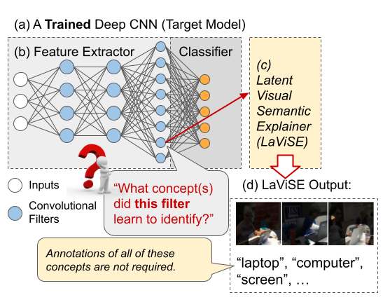

# Requirements

## Data

- Please follow the instructions in the 
[COCO API README](https://github.com/cocodataset/cocoapi) and 
[here](data/README.md) to download and setup the COCO2017 data. Link the dataset
under ```data/coco```. The folder ```data/coco``` should contain the folders
```val2017```, ```train2017``` and files ```annotations/instances_val2017.json```, 
and ```annotations/instances_train2017.json```.

## Packages
PyTorch, torchvision, wandb, and torchtext. A full list can be found in `requirements.txt`.

## Training

to train an explainer on COCO for 50 epochs on layer4 representations of a ResNet50 trained on ImageNet, run
```
python train_explainer.py --layer layer4 --refer coco --wandb False --epochs 50 --name run_name
```
set wandb to True to log using wandb. Training on a single 24gb GPU takes 1-2 days.


To visualize filters on wandb using the trained explainer, run:

```
python infer_filter.py --layer layer4 --name run_name --wandb True --refer coco
```

Line 200 in ```infer_filter.py``` can be uncommented to visualize the filters without wandb
Here is the readme from the OG LaViSE repository:

# OG LaViSE README
This is the official repository for paper "Explaining Deep Convolutional Neural Networks via Unsupervised 
Visual-Semantic Filter Attention" to appear in CVPR 2022. 

Authors: Yu Yang, Seungbae Kim, Jungseock Joo



[//]: # (## Requirements)

## Datasets
### [Common Objects in Context (COCO)](https://cocodataset.org/#home) 

- Please follow the instructions in the 
[COCO API README](https://github.com/cocodataset/cocoapi) and 
[here](data/README.md) to download and setup the COCO data.

### [Visual Genome (VG)](https://visualgenome.org/)

- Please follow the instructions in the 
[README of the python wrapper for the Visual Genome API](https://github.com/ranjaykrishna/visual_genome_python_driver) 
and [here](data/README.md).

### [GloVe](https://nlp.stanford.edu/projects/glove/)

- We load the pretrained GloVe word embeddings directly from the 
[torchtext](https://torchtext.readthedocs.io/en/latest/vocab.html#glove) library.

### Social Media <u>P</u>hotographs <u>o</u>f US <u>P</u>oliticians (PoP)

- The list of entities used to discover new concepts is provided in `data/entities.txt`.

## Getting started 

### Requirements

Required packages can be found in `requirements.txt`.

### Usage

Train an explainer with

```commandline
python train_explainer.py
```

Explain a target filter of any model with

```commandline
python infer_filter.py
```

More features will be added soon! 🍻

## Citation
```
@inproceedings{yang2022explaining,
    author    = {Yang, Yu and Kim, Seungbae and Joo, Jungseock},
    title     = {Explaining Deep Convolutional Neural Networks via Unsupervised Visual-Semantic Filter Attention},
    booktitle = {Proceedings of the IEEE/CVF Conference on Computer Vision and Pattern Recognition (CVPR)},
    year      = {2022},
}
```
